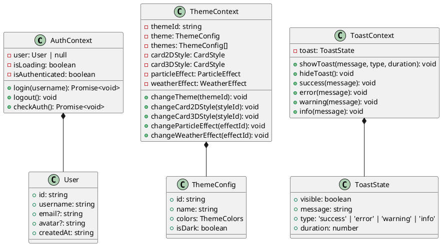
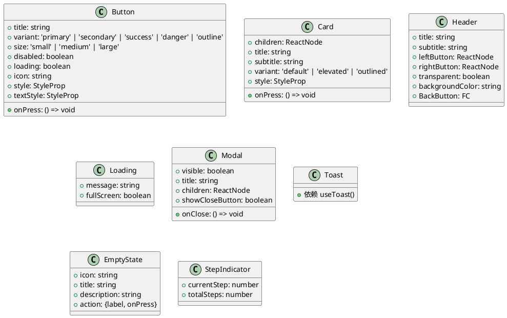
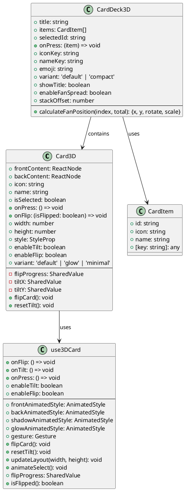
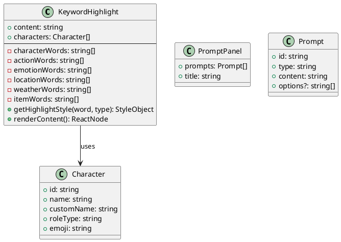
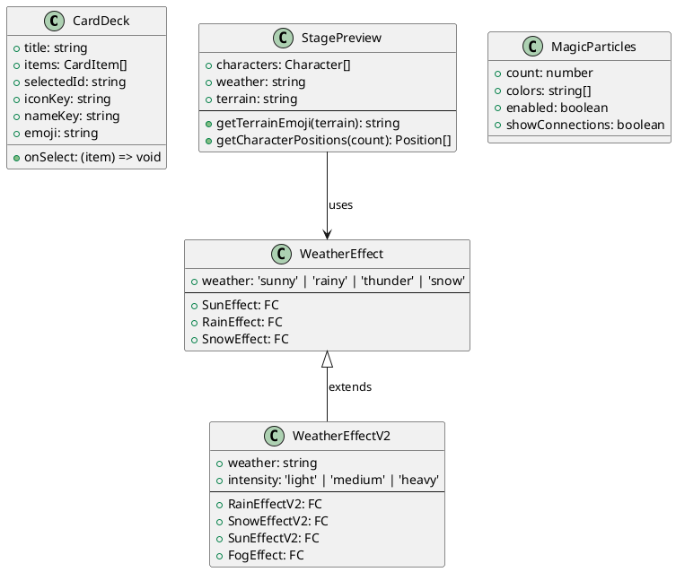
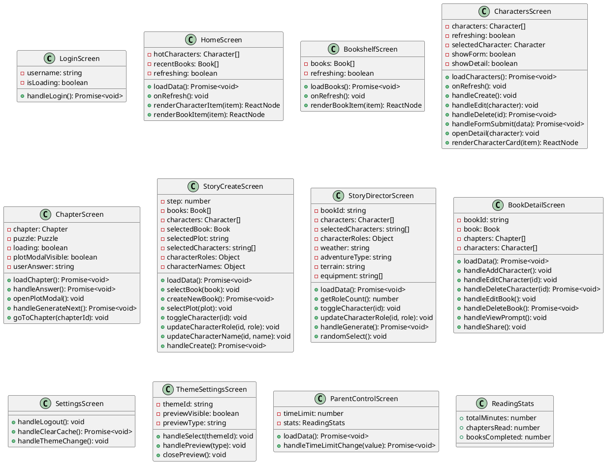
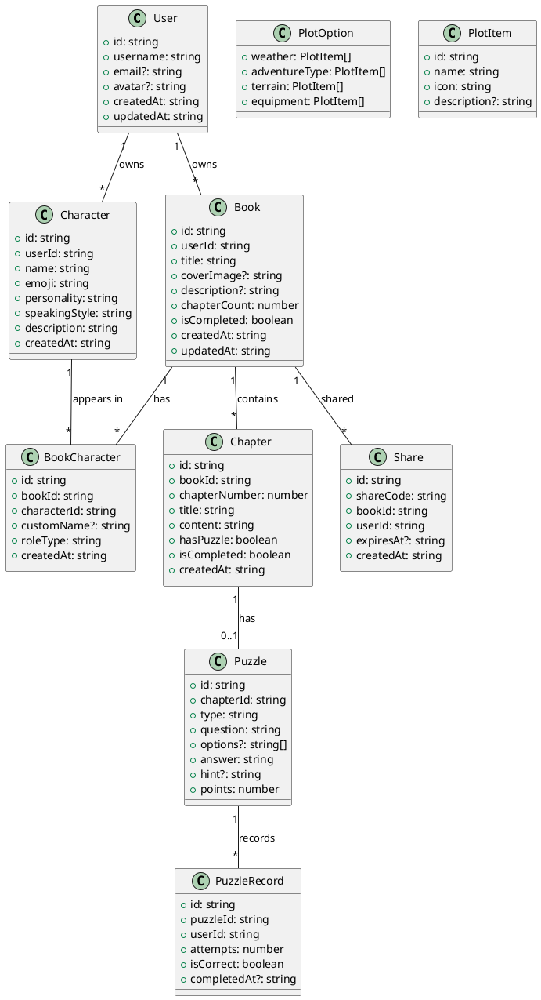
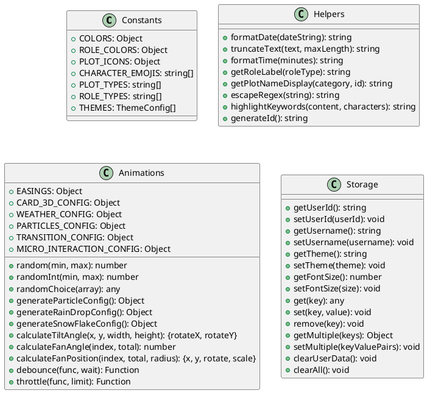
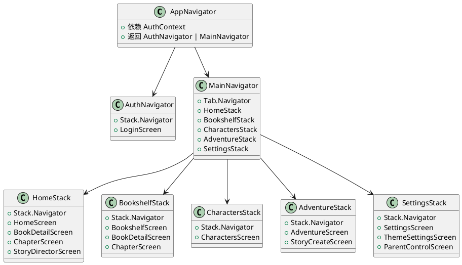

# LEGO Mobile UML 类图文档

## 一、整体架构图

```plantuml
@startuml Architecture
!define RECTANGLE class

package "API Layer" {
    [APIClient] as APIClient
    [usersAPI] as UsersAPI
    [charactersAPI] as CharactersAPI
    [booksAPI] as BooksAPI
    [chaptersAPI] as ChaptersAPI
    [puzzleAPI] as PuzzleAPI
    [storyAPI] as StoryAPI
    [shareAPI] as ShareAPI
}

package "Context Layer" {
    [AuthContext] as AuthCtx
    [ThemeContext] as ThemeCtx
    [ToastContext] as ToastCtx
}

package "Hooks Layer" {
    [use3DCard] as Use3DCard
    [useParticles] as UseParticles
}

package "Component Layer" {
    package "Common" {
        [Button] as Button
        [Card] as Card
        [Header] as Header
        [Loading] as Loading
        [Modal] as Modal
        [Toast] as Toast
        [EmptyState] as EmptyState
        [StepIndicator] as StepIndicator
    }
    
    package "Card3D" {
        [Card3D] as Card3D
        [CardDeck3D] as CardDeck3D
    }
    
    package "Story" {
        [CardDeck] as CardDeck
        [StagePreview] as StagePreview
        [WeatherEffect] as WeatherEffect
    }
    
    package "Chapter" {
        [KeywordHighlight] as KeywordHighlight
        [PromptPanel] as PromptPanel
    }
    
    package "Characters" {
        [CharacterForm] as CharacterForm
    }
    
    package "Weather" {
        [WeatherEffectV2] as WeatherEffectV2
    }
    
    package "Particles" {
        [MagicParticles] as MagicParticles
    }
}

package "Screen Layer" {
    [LoginScreen] as LoginScreen
    [HomeScreen] as HomeScreen
    [BookshelfScreen] as BookshelfScreen
    [CharactersScreen] as CharactersScreen
    [ChapterScreen] as ChapterScreen
    [StoryCreateScreen] as StoryCreateScreen
    [StoryDirectorScreen] as StoryDirectorScreen
    [BookDetailScreen] as BookDetailScreen
    [SettingsScreen] as SettingsScreen
    [ThemeSettingsScreen] as ThemeSettingsScreen
    [ParentControlScreen] as ParentControlScreen
    [AdventureScreen] as AdventureScreen
}

package "Navigation" {
    [AppNavigator] as AppNavigator
    [AuthNavigator] as AuthNavigator
    [MainNavigator] as MainNavigator
}

package "Utils" {
    [constants] as Constants
    [helpers] as Helpers
    [animations] as Animations
    [storage] as Storage
}

' API Dependencies
APIClient <|-- UsersAPI
APIClient <|-- CharactersAPI
APIClient <|-- BooksAPI
APIClient <|-- ChaptersAPI
APIClient <|-- PuzzleAPI
APIClient <|-- StoryAPI
APIClient <|-- ShareAPI

' Context Dependencies
AuthCtx --> UsersAPI
AuthCtx --> Storage
ThemeCtx --> Storage
ToastCtx --> Storage

' Screen Dependencies
LoginScreen --> AuthCtx
LoginScreen --> UsersAPI
HomeScreen --> AuthCtx
HomeScreen --> BooksAPI
HomeScreen --> CharactersAPI
BookshelfScreen --> AuthCtx
BookshelfScreen --> BooksAPI
CharactersScreen --> AuthCtx
CharactersScreen --> CharactersAPI
CharactersScreen --> Card3D
ChapterScreen --> AuthCtx
ChapterScreen --> ChaptersAPI
ChapterScreen --> PuzzleAPI
ChapterScreen --> KeywordHighlight
StoryCreateScreen --> AuthCtx
StoryCreateScreen --> BooksAPI
StoryCreateScreen --> CharactersAPI
StoryCreateScreen --> ChaptersAPI
StoryDirectorScreen --> AuthCtx
StoryDirectorScreen --> ChaptersAPI
StoryDirectorScreen --> CardDeck3D
BookDetailScreen --> AuthCtx
BookDetailScreen --> BooksAPI
BookDetailScreen --> ChaptersAPI
SettingsScreen --> AuthCtx
ThemeSettingsScreen --> ThemeCtx
ParentControlScreen --> AuthCtx

' Component Dependencies
Card3D --> Use3DCard
Card3D --> Animations
CardDeck3D --> Card3D
CardDeck3D --> Animations
KeywordHighlight --> Helpers
WeatherEffectV2 --> Animations
MagicParticles --> UseParticles

' Navigation Dependencies
AppNavigator --> AuthNavigator
AppNavigator --> MainNavigator
AppNavigator --> AuthCtx

@enduml
```

## 二、API 层类图

```plantuml
@startuml API_Layer

class APIClient {
    - baseURL: string
    + request(endpoint, options): Promise
    + get(endpoint, options): Promise
    + post(endpoint, body, options): Promise
    + put(endpoint, body, options): Promise
    + delete(endpoint, options): Promise
    - handleError(error): void
}

class UsersAPI {
    + createOrLogin(username, email?): Promise<{userId, message, isNewUser}>
    + getUser(userId): Promise<{user}>
    + updateUser(userId, data): Promise<{message}>
}

class CharactersAPI {
    + getList(userId?): Promise<{characters}>
    + create(data): Promise<{characterId, message}>
    + update(characterId, data): Promise<{message}>
    + delete(characterId, force?): Promise<{message}>
}

class BooksAPI {
    + getList(userId): Promise<{books}>
    + getDetail(bookId, userId?): Promise<{book, chapters, characters}>
    + create(userId, title): Promise<{bookId, message}>
    + update(bookId, data): Promise<{message}>
    + delete(bookId): Promise<{message}>
}

class BookCharactersAPI {
    + getList(bookId): Promise<{characters}>
    + add(bookId, characterId, customName, roleType?): Promise<{message, id}>
    + update(id, data): Promise<{message}>
    + delete(id, force?): Promise<{message}>
}

class ChaptersAPI {
    + getDetail(chapterId, userId?): Promise<{chapter, puzzle, puzzleRecord}>
    + getListByBook(bookId, userId?): Promise<{chapters}>
    + create(bookId, title, content, puzzle?): Promise<{chapterId, chapterNumber, message}>
    + delete(chapterId): Promise<{message}>
    + complete(bookId, chapterId, userId): Promise<{message}>
    + generate(bookId, userId, plotSelection?, characterIds?): Promise<{chapterId, chapterNumber, title, hasPuzzle, prompt, message}>
}

class PuzzleAPI {
    + getById(puzzleId): Promise<{puzzle}>
    + getByChapter(chapterId): Promise<{puzzle}>
    + submit(puzzleId, userId, userAnswer): Promise<{isCorrect, attempts, attemptsRemaining, hint?, message}>
}

class PlotOptionsAPI {
    + get(): Promise<{plotOptions}>
}

class StoryAPI {
    + generate(params: StoryGenerateParams): Promise<StoryGenerateResult>
}

class ShareAPI {
    + create(bookId, userId, options?): Promise<{shareId, shareCode, message}>
    + getByBook(bookId, userId): Promise<{shares}>
    + getByCode(code): Promise<{share}>
    + delete(shareId): Promise<{message}>
}

APIClient <|-- UsersAPI
APIClient <|-- CharactersAPI
APIClient <|-- BooksAPI
APIClient <|-- ChaptersAPI
APIClient <|-- PuzzleAPI
APIClient <|-- StoryAPI
APIClient <|-- ShareAPI

BooksAPI *-- BookCharactersAPI : contains
PuzzleAPI *-- PlotOptionsAPI : contains

@enduml
```



## 三、Context 层类图



## 四、组件层类图

### 4.1 通用组件



### 4.2 3D卡牌组件



### 4.3 章节组件



### 4.4 故事组件



## 五、Screen 层类图



## 六、数据模型类图



## 七、工具类类图



## 八、导航类图



---

## 附录：PlantUML 渲染说明

以上 UML 图使用 PlantUML 语法编写，可以通过以下方式渲染：

1. **VS Code 插件**: 安装 "PlantUML" 插件，直接预览
2. **在线工具**: 访问 https://www.plantuml.com/plantuml/uml/
3. **命令行**: 安装 plantuml 后执行 `plantuml diagram.puml`

每个 `@startuml` 和 `@enduml` 之间的内容是一个独立的图，可以单独渲染。
